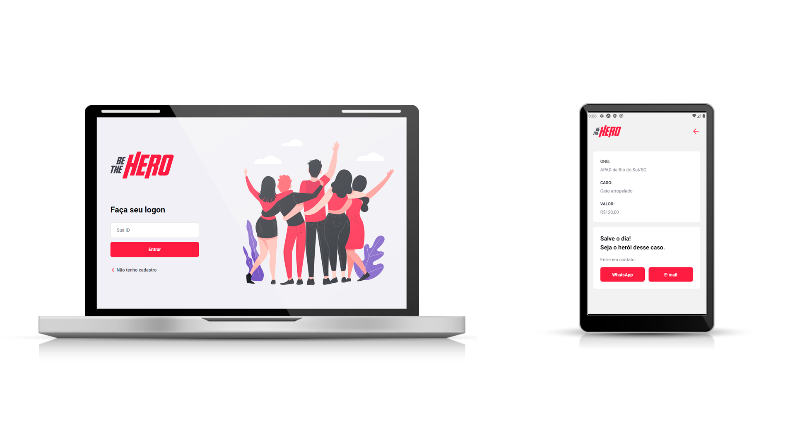

# BE THE HERO
<h1 align="center">
    
</h1>
<h4 align="center">
  💻 Be The Hero
  🚀 Semana OmniStack 11.0
</h4>

  

## 💻 Sobre o Projeto

O Be-The-Hero é um projeto teste da Semana OmniStack 11.0 para conectar pessoas que desejam fazer contribuições monetárias a ONG's que necessitam de ajuda para realizar suas atividades.

 ## 💻 Tecnologias do Projeto
<h4 align="center">
   - Backend, Frontend, Mobile, Tests
</h4>

- [Node.js](https://nodejs.org)
- [React Js](https://reactjs.org)
- [React Native](https://reactnative.dev/)
- [Expo](https://expo.io/)

## 💻 Como acessar esse repositório
- Faça um fork do repositório
- Faça um push para a sua branch: `git push origin minha-feature`

## :memo: Licença

Esse projeto está sob a licença MIT. Para mais detalhes acesse: [LICENSE](.github/LICENSE.md).

